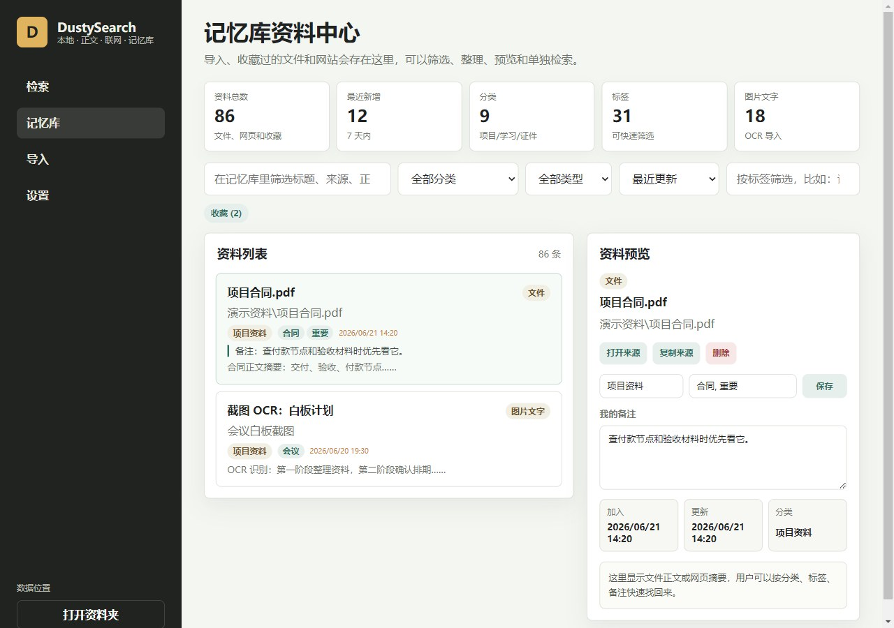
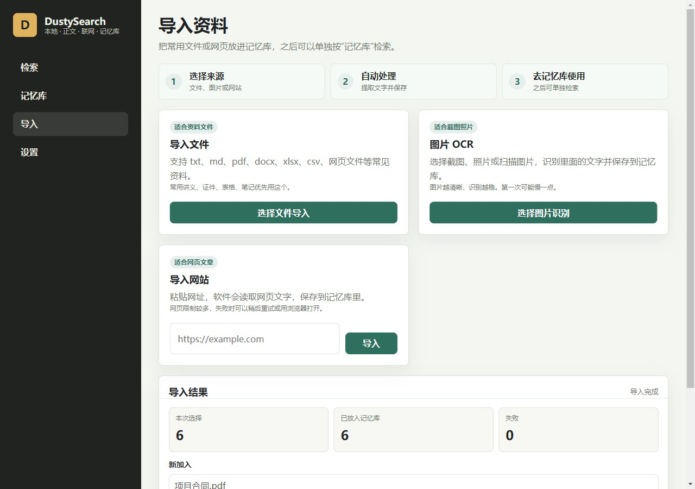

# DustySearch

一个 Windows 本地资料搜索和记忆库软件。

它适合资料很多、截图很多、文件到处放、网页收藏也容易忘的人。你可以用它搜索本机文件名、PDF/Word/Excel/TXT/Markdown/CSV 正文、截图里的文字、导入过的网站和自己收藏的资料。

DustySearch 的重点不是把你的资料上传到云端，而是把常用资料留在自己电脑里，做成一个好找、好预览、好整理的个人记忆库。

[下载 Windows 版](https://github.com/Dusty7-cloud/DustySearch/releases/latest)

## 界面预览

### 检索中心

一个入口同时查文件名、正文、记忆库和少量网页摘要。


### 记忆库

把常用文件、网页、截图 OCR 结果保存起来，加分类、标签和备注。



### 导入资料

导入文件、识别图片文字，或者把网页文字保存进记忆库。



### 资料体检

检查资料夹、索引、记忆库、备份、读取失败和可读取格式。


## 能做什么

- 搜本机文件名。
- 搜 TXT、Markdown、PDF、Word、Excel、CSV 等常见文件正文。
- 把重要文件和网页导入记忆库。
- 用 OCR 识别截图、照片、扫描图里的文字。
- 把有用的搜索结果一键收藏到记忆库。
- 给记忆库资料加分类、标签和自己的备注。
- 在打开文件前，先看命中原因和内容预览。
- 搜索结果很多时自动分组，减少一长串结果带来的混乱。
- 支持 `type:pdf`、`ext:docx`、`tag:course`、`cat:documents` 这类简单筛选。
- 保存不同资料夹组合，作为不同资料区使用。
- 支持备份、恢复、导出，以及用网盘文件夹同步记忆库数据。

## 适合谁

你可能会喜欢 DustySearch，如果你：

- 经常想不起文件、截图、笔记或网页保存在哪里。
- 需要把 PDF、Word、Excel、CSV、文本文件放在一起搜。
- 想要一个本地个人资料库，不想把私人文件上传到陌生服务。
- 经常保存截图或扫描图，而且里面有以后会用到的文字。
- 想要一个轻一点的桌面工具，而不是复杂的文档管理系统。

## 隐私说明

DustySearch 是本地优先的软件。

- 记忆库数据保存在你自己的电脑上。
- 用户数据默认放在：

```text
%USERPROFILE%\Documents\DustySearchData
```

- “网页摘要”可以在设置里关闭。
- “浏览器搜索”会直接打开你的浏览器。
- 云同步不会登录任何账号。它只使用你自己已经同步好的 OneDrive、Dropbox、坚果云、U 盘或其他本地同步文件夹。

## 安装

### 方法一：下载 Windows 版本

打开最新版发布页：

```text
https://github.com/Dusty7-cloud/DustySearch/releases/latest
```

下载 `DustySearch-Windows-v1.0.0.zip` 后，解压到一个固定位置，例如桌面或下载文件夹。

然后打开解压出来的 `DustySearchApp` 文件夹，双击：

```text
Start-DustySearch.cmd
```

如果 Windows 弹出安全提醒，请确认文件来自本仓库后，再选择继续运行。

### 方法二：从源码安装

```powershell
git clone https://github.com/Dusty7-cloud/DustySearch.git
cd DustySearch
npm install
powershell -NoProfile -ExecutionPolicy Bypass -File .\Install-DustySearch.ps1
```

安装脚本会把软件复制到：

```text
%LOCALAPPDATA%\DustySearchApp
```

并在桌面创建 `DustySearch` 快捷方式。

## 开发运行

```powershell
npm install
npm start
```

## 一键自检

DustySearch 内置自检模式，用来确认主要功能是否正常：

```powershell
.\node_modules\electron\dist\electron.exe . --self-check
```

报告会写入：

```text
%USERPROFILE%\Documents\DustySearchData\self-check-result.json
```

自检覆盖本地文件名搜索、正文搜索、记忆库搜索、OCR 导入、收藏结果、资料区、同步包、云同步文件夹、隐私设置、备份、导出、资料体检和导入结果总结。

## 构建

```powershell
npm install
npm run build
```

构建结果会放到 `release/`。

## English Summary

DustySearch is a Windows desktop search and memory library for local files, document text, screenshots, and saved web pages. It is local-first, supports OCR, document text search, memory notes, tags, backups, and cloud-folder sync.

## 备注

- `node_modules`、构建产物、发布文件和临时检查文件不会提交到仓库。
- PDF、Word、Excel 和 OCR 支持依赖内置解析库。
- 个人记忆库数据不要上传到 GitHub。
